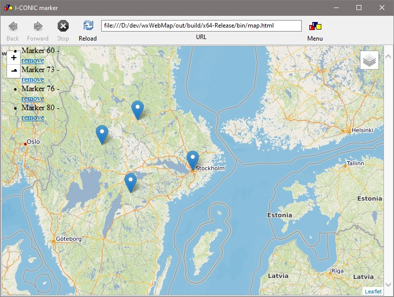

# wxWebMap
A C++ library enabling web maps in desktop applications (Windows, Linux, MacOS). 

## wxWidgets
The library is based on ```wxWidgets``` and the web map is displayed using a ```wxWebView``` window.

## leafletjs
The map functionality is implemented using ```leafletjs```. ```Leafletjs javascript``` snippets to e.g. add a marker to a map are executed by calling e.g. ```wxWebMap::AddMapObject```. 

## Sample application
In examples/wxWebMapApplication there is a sample application with GUI. It is based on the wxWidgets wxWebView sample. However, it opens a map in the web view. 
You can click in the map to add markers. These markers can be dragged on the map. A list with markers is seen to the left and a \c 'remove' link enables deleting a marker.
You can progammatically add a marker from ```menu->Run Script->Put marker on Stockholm```.



## Build instructions

### Windows
* Clone the wxWebMap repository at https://github.com/HWiman-ICONIC/wxWebMap
* Install vcpkg by following these instructions: https://vcpkg.io/en/getting-started.html
* Install the wxWidgets and boost libraries: ```.\vcpkg.exe install wxwidgets:x64-windows boost:x64-windows``` in e.g. powershell (Admin mode)
    * If you run into problems when compiling wxWidgets or even if compilation works but you get messages like "wx*.dll not found" when running sample applications. Replace the ```./vcpkg/ports/wxwidgets/portfile.cmake``` with the one in ```wxWebMap/cmake/portfile.cmake``` and rebuild wxWidgets (```vcpkg install wxwidgets:x64-windows```).
* Open VisualStudio and choose the ```Open a local folder``` option.
* This will trigger CMake to parse the project. 
    * You may get warnings, but in the Output tab you should see 'CMake finished'
* Now Build->Build all
* Set target to e.g. bin/wxWebMapApp.exe and run the application